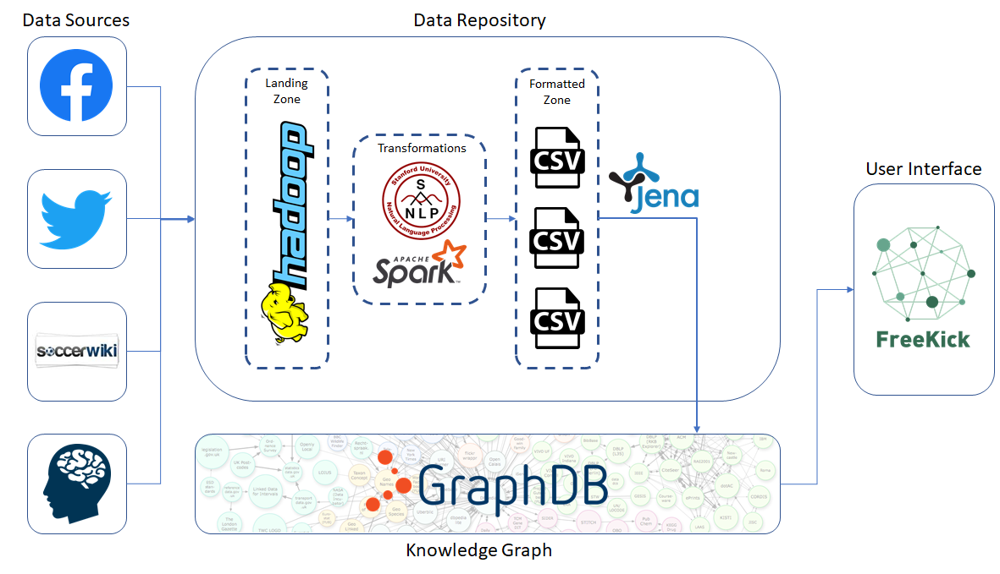

# FreeKick

Freekick is a software that aims to fill the gap between football players and scouters from mid-size teams. It offers a new scouting process mainly based on the psychological characteristics, implemented through the usage of behavioural tests and social media analysis.

The project is composed by several parts. 

In a glance, the overall architecture is organized as:

The complete report regarding the organization and storing of our data is 

**Big Data Management - Report.pdf**

The complete report regarding the semantic exploitation of the data is 

**Semantic Data Management - Report.pdf**

Finally, a pitch and a Business Plan are presented.
